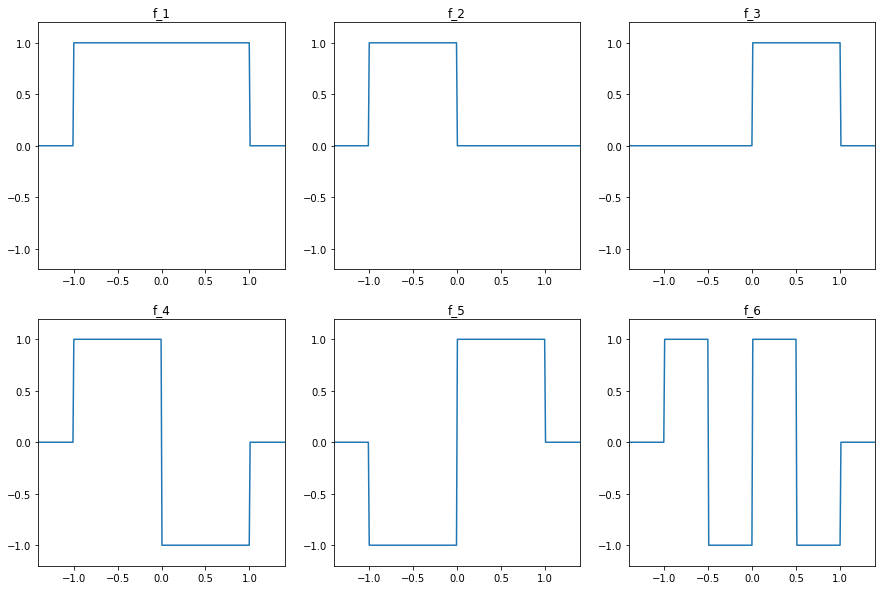

# Imports


```python
import numpy as np
import matplotlib.pyplot as plt
import librosa as lr
from IPython.display import Audio
```

# Ähnlichkeitsmaß

Übungsaufgabe aus: Müller, M. (2015). Fundamentals of music processing: Audio, analysis, algorithms, applications (Vol. 5). Springer, S. 110.

Um die Ähnlichkeit zweier Funktionen zueinander zu berechnen, nehmen wir das Integral (die Fläche unter der Kurve bis zur x-Achse) des Produkts der beiden Funktionen:

$⟨ f |g⟩ := \int_{t \in R} \left(f (t) · g(t) \right) \, dt$

<!--  -->


<div style="background-color:lightyellow;border:solid grey;padding:10px">

**Aufgabe 1:**

Berechnet alle Ähnlichkeitsmaße jeder Funktion zu jeder anderen Funktion und füllt das Ergebnis in die Tabelle:

|    | f1 | f2 | f3 | f4 | f5 | f6 |
|----|----|----|----|----|----|----|
| f1 |  2 |  1 |  1 |  0 |  0 |  0 |
| f2 |    |  1 |  0 |  1 | -1 |  0 |
| f3 |    |    |  1 | -1 |  1 |  0 |
| f4 |    |    |    |  2 | -2 |  0 |
| f5 |    |    |    |    |  2 |  0 |
| f6 |    |    |    |    |    |  2 |

</div>

# Appendix


```python
# code fuer grafik

sr = 100
length = 4
f1 = np.concatenate((np.zeros(sr), np.ones(int(sr * 2)), np.zeros(sr)))
f2 = np.concatenate((np.zeros(sr), np.ones(sr), np.zeros(int(sr * 2))))
f3 = np.concatenate((np.zeros(int(sr * 2)), np.ones(sr), np.zeros(sr)))
f4 = np.concatenate((np.zeros(sr), np.ones(sr), np.ones(sr) * -1, np.zeros(sr)))
f5 = np.concatenate((np.zeros(sr), np.ones(sr) * -1, np.ones(sr), np.zeros(sr)))
f6 = np.concatenate((np.zeros(sr), np.ones(int(sr / 2)), np.ones(int(sr / 2)) * -1, np.ones(int(sr / 2)), np.ones(int(sr / 2)) * -1, np.zeros(sr)))
t = np.linspace(length / -2, length /  2, int(sr * length))

funcs = np.array([f1, f2, f3, f4, f5, f6])
funcs_names = np.array(['f_1', 'f_2', 'f_3', 'f_4', 'f_5', 'f_6'])


fig, axs = plt.subplots(2, 3, figsize=(5 * 3, 5 * 2))

for func, ax, funcs_name in zip(funcs, axs.flatten(), funcs_names):
    
    ax.plot(t, func)
    ax.set_ylim(-1.2, 1.2)
    ax.set_xlim(length / -2 + 0.6, length / 2 - 0.6)
    ax.set_title(funcs_name)

plt.show()
```


    

    

