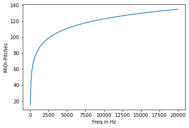

```python
import numpy as np
import matplotlib.pyplot as plt
```

## MIDI-Pitch - Frequenz

$f = 440 \cdot 2^{\frac{p - 69}{12}}$


```python
def mtof(p):
    return 440 * 2 ** ((p - 69) / 12)
```


```python
print(mtof(69))
print(mtof(69 + 12))
print(mtof(69 - 12))
print(mtof(69 + 1))
print(mtof(60))
print(mtof(69 + 0.5))
```

    440.0
    880.0
    220.0
    466.1637615180899
    261.6255653005986
    452.8929841231365


$$\begin{eqnarray}
f &=& 440 \cdot 2^{\frac{p - 69}{12}} &|& \cdot \frac{1}{440}\\
\frac{f}{440} &=& 2^{\frac{p - 69}{12}} &|& \log_2 \\
\log_2{\left(\frac{f}{440}\right)} &=& \frac{p - 69}{12} &|& \cdot 12 \\
12 \cdot \log_2{\left(\frac{f}{440}\right)} &=& p - 69 &|& + 69 \\
12 \cdot \log_2{\left(\frac{f}{440}\right)} + 69 &=& p \\
\end{eqnarray}$$


```python
def ftom(f):
    return 12 * np.log2(f / 440) + 69
```


```python
print(ftom(440.0))
print(ftom(880.0))
print(ftom(220.0))
print(ftom(466.1637615180899))
print(ftom(261.6255653005986))
print(ftom(452.8929841231365))
```

    69.0
    81.0
    57.0
    70.0
    60.0
    69.5


```python
pitches = np.arange(21, 128)

print(mtof(pitches[0]))

plt.plot(mtof(pitches))
plt.xlabel('MIDI-Pitches')
plt.ylabel('Freq. in Hz')
plt.show()
```

^e45f90

(Achsenbeschriftung siehe: [Matplotlib: Achsenbeschriftung](/topics/matplotlib.md#Achsenbeschriftung))

    27.5


    

    


```python
freqs = np.linspace(20, 20000, 200)


plt.plot(freqs, ftom(freqs))
plt.xlabel('Freq in Hz')
plt.ylabel('MIDI-Pitches')
plt.show()
```

^7159a7


    

    

