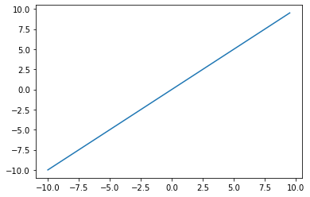
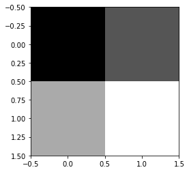
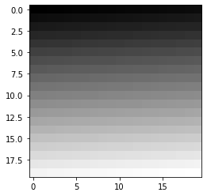

# Matplotlib


```python
import matplotlib.pyplot as plt
import numpy as np
```

## `plot`

$f(x) = x$


```python
x = np.arange(-10, 10, 0.5)
y = x

plt.plot(x, y)
plt.show()
```


    

    


```python
x = np.arange(-10, 10, 0.5)
y = (x ** 3) - 50

plt.figure(figsize=(10, 10))
plt.plot(x, y, 'o-')
# plt.xlim(-5, 5)
plt.show()
```


    

    


## `imshow`


```python
a = np.reshape(np.linspace(0, 1, 4), (2, 2))

a
```


    array([[0.        , 0.33333333],
           [0.66666667, 1.        ]])


```python
plt.imshow(a, cmap='gray') # cmap: color-map
plt.show()
```


    

    


```python
a = np.reshape(np.linspace(0, 1, 400), (20, 20))

# a
```


```python
plt.imshow(a, cmap='gray') # cmap: color-map
# plt.axis('off')
plt.show()
```


    

    

